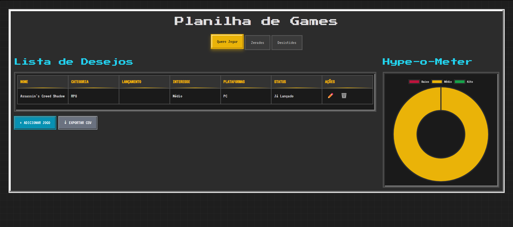

# 🎮 Planilha Gamer Pixelada

> **Organize sua vida gamer** com estilo retrô!  
> Este projeto é uma aplicação web interativa, com design pixelado, que ajuda você a gerenciar **jogos que quer jogar**, **jogos zerados** e **jogos desistidos** — tudo com gráficos, estatísticas e animações.

---

## 🕹 Funcionalidades

### 📜 **Aba Quero Jogar**

- Lista de desejos com:
  - Nome, categoria, data de lançamento, interesse, plataformas e status
- Botão para **adicionar novos jogos**
- Exportação da lista em **CSV**
- **Gráfico de Hype** (*Hype-o-Meter*) com base no interesse

---

### 🏆 **Aba Jogos Zerados**

- Hall da Fama para registrar:
  - Nome, categoria, nota em estrelas, data que zerou, plataforma, tempo gasto e avaliação
- Estatísticas com:
  - **Total de jogos zerados**
  - **Tempo médio gasto**
  - Gráfico de distribuição de notas
- Exportação em **CSV**

---

### 👻 **Aba Jogos Desistidos**

- Cemitério Gamer para:
  - Nome, categoria, motivo, tempo jogado e observações
- Gráfico com **motivos de desistência**
- Exportação em **CSV**

---

## 📊 Recursos Extras

- **Gráficos dinâmicos** com [Chart.js](https://www.chartjs.org/)
- **Persistência de dados** no `localStorage`
- **Animações de entrada** para tabelas e elementos
- **Notificações (toast)** para ações importantes
- **Modais** estilizados para formulários
- **Atalhos de teclado**:
  - `Ctrl + 1` → Aba *Quero Jogar*
  - `Ctrl + 2` → Aba *Zerados*
  - `Ctrl + 3` → Aba *Desistidos*
  - `ESC` → Fecha modais
- **Exportação CSV** com um clique

---

## 🖼 Prévia



---

## 🚀 Tecnologias Utilizadas

- **HTML5** – Estrutura semântica
- **CSS3 + Tailwind CSS** – Estilo pixelado retrô + responsividade
- **JavaScript (ES6)** – Lógica e interatividade
- **Chart.js** – Visualização de dados
- **LocalStorage** – Salvando seus jogos mesmo após fechar o navegador

---

## 📦 Como Usar

1. **Clone o repositório**

   ```bash
   git clone https://github.com/seu-usuario/seu-repositorio.git
   ```

2. **Acesse a pasta**

   ```bash
   cd seu-repositorio
   ```

3. **Abra o `index.html` no navegador**
   - Não é necessário instalar nada — o projeto roda direto no navegador.

---

## 🎨 Personalização

- As cores, fontes e bordas pixeladas estão no arquivo [`style.css`](style.css).
- Você pode alterar as animações, sombras e paleta para criar **sua própria identidade gamer**.
- Os gráficos usam as configurações iniciais do [`script.js`](script.js), mas podem ser ajustados.

---

## 💾 Estrutura de Arquivos

```plaintext
📂 projeto
 ├── index.html      # Estrutura principal da aplicação
 ├── style.css       # Estilo pixelado e responsividade
 ├── script.js       # Lógica, gráficos e interações
```

---

## 🏹 Roadmap de Melhorias

- [ ] Adicionar autenticação de usuário
  - [ ] Registro de usuários
  - [ ] Armazenamento seguro de dados
- [ ] Adicionar suporte a múltiplos usuários
  - [ ] Login e logout
  - [ ] Armazenamento separado para cada usuário
- [ ] Versão mobile otimizada para toque
- [ ] Validação de formulários
- [ ] Adicionar suporte a imagens/capas dos jogos
- [ ] Criar sistema de backup/importação de dados
- [ ] Melhorar filtros e ordenação das tabelas
- [ ] Versão mobile otimizada para toque

---

## 📜 Licença

Este projeto é de uso livre para fins de estudo e diversão gamer. 🎮  
Sinta-se à vontade para modificar e compartilhar!

---

> **Dica:** salve o projeto no seu navegador favorito para manter sempre sua **biblioteca gamer pixelada** atualizada!
